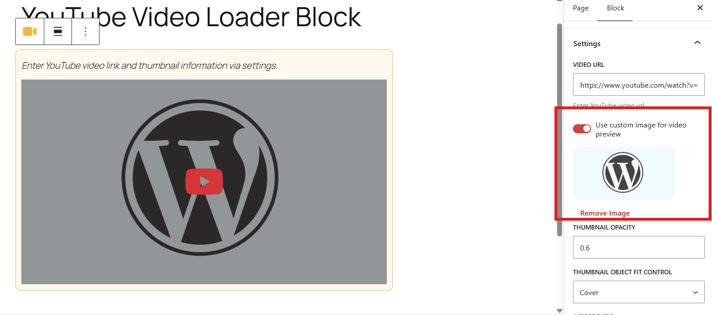
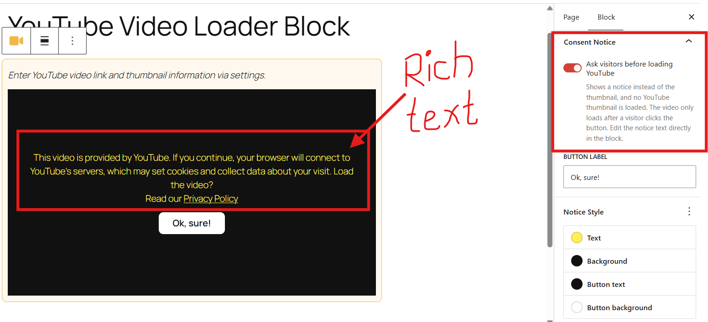
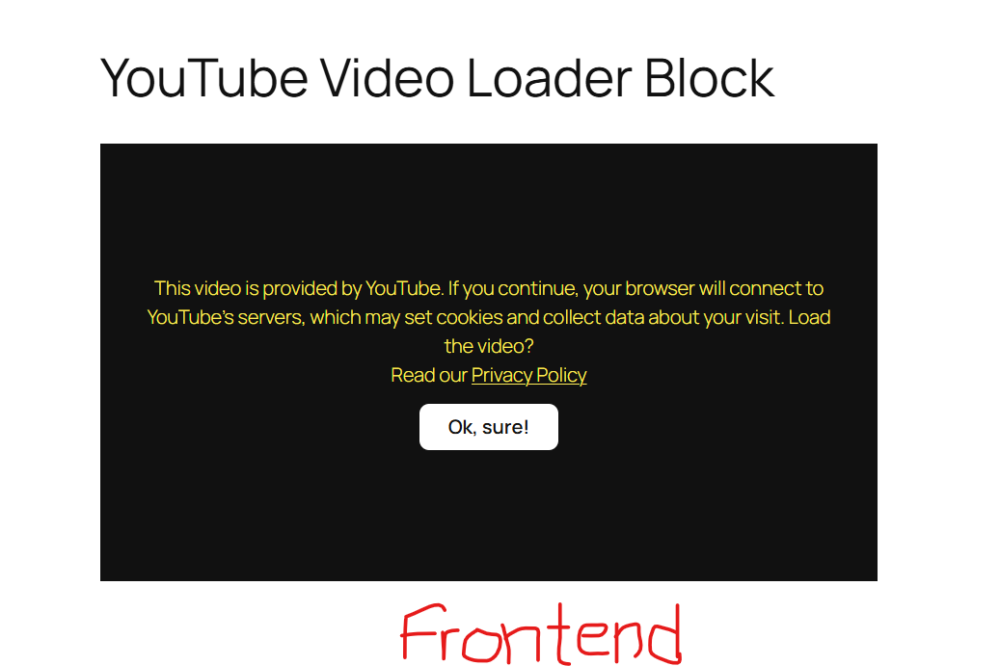
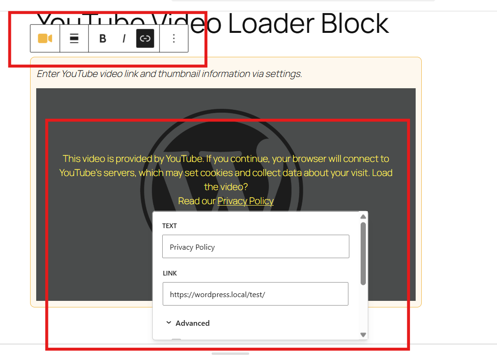
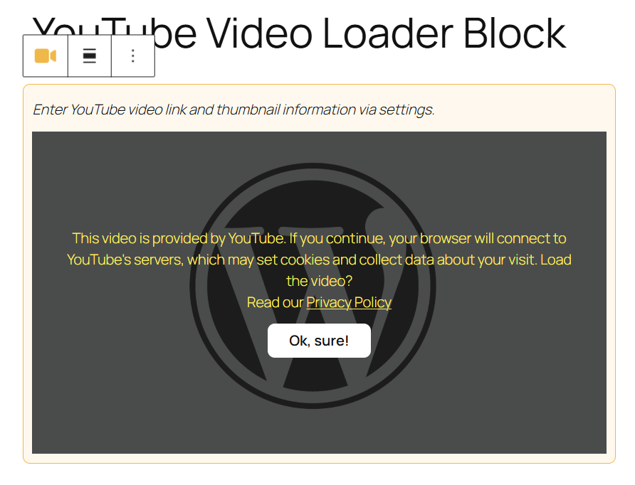
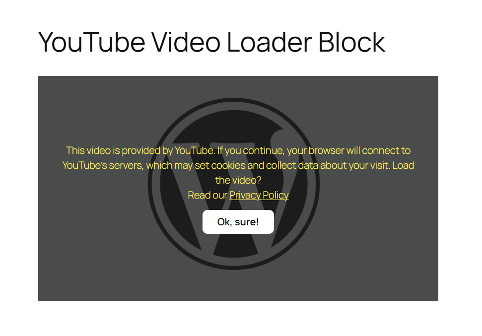

# YouTube Video Loader

A WordPress block that inserts YouTube videos efficiently. The frontend shows only a preview thumbnail, and no YouTube scripts load until the visitor clicks.


## Features

**Performance**
- Thumbnail-first: nothing from YouTube is loaded until the visitor clicks.
- Optional lazy loading for the thumbnail (turn it off for above-the-fold or hero videos).
- Choice of thumbnail quality: `mqdefault`, `hqdefault`, `sddefault` or `maxresdefault`. The editor warns you if the chosen quality doesn't exist for a video.


**Appearance**
- Custom preview image, or the default YouTube thumbnail.
- Thumbnail fit and opacity, frame width and aspect ratio (default `16/9`).
- Wide and full alignment, and a border radius control.
- Optional caption below the video.



**Playback and accessibility**
- Mute on autoplay toggle.
- Alt text for the default YouTube thumbnail.
- Keyboard-accessible click-to-load overlay.

**Consent notice**
- Optional per-block notice shown instead of the thumbnail, with a "Yes" button that loads the video.
- Notice text is edited in place and supports links (e.g. to your privacy policy).
- Notice Style controls: text color, notice background, button background, button text color and font size.





Add a link (for example to your privacy policy) directly inside the notice text:



Style it to match your brand:





**Playback and accessibility**
- Mute on autoplay toggle.
- Alt text for the default YouTube thumbnail.
- Keyboard-accessible click-to-load overlay.

## Requirements

- WordPress 6.9+
- PHP 8.0+
- For building from source: Node.js 22.14.0+ and npm
- For development: Composer (used for PHP linting only)

## Download

[**Download the latest release (youtube-video-loader.zip)**](https://github.com/wpbt/youtube-video-loader/releases/latest/download/youtube-video-loader.zip)

The zip is ready to use and needs no build step:

1. In WordPress admin, go to **Plugins → Add New → Upload Plugin**.
2. Choose the zip and click **Install Now**.
3. Activate the plugin, then add the **YouTube Video Loader** block from the Media category.

Prefer to build it yourself? See [Installation (from source)](#installation-from-source) below.

## Installation

Make sure to generate the build before activation.

1. Clone or copy this repository into `wp-content/plugins/youtube-video-loader/`.
2. Build the block:
```bash
   cd ytvl-block/
   npm install
   npm run build
```
3. Confirm that `ytvl-block/build/` now exists.
4. Run `composer install` from the plugin root to install the coding standards dependencies (PHPCS and WPCS). This is only needed if you plan to lint PHP code.
5. Activate **YouTube Video Loader** in the WordPress admin under Plugins.

## Usage

1. In the editor, add the **YouTube Video Loader** block (Media category).
2. Paste a YouTube link.
3. Adjust the thumbnail, layout, playback and consent options in the block sidebar.


## Development

| Command | Where | Purpose |
| --- | --- | --- |
| `npm start` | `ytvl-block/` | Build in watch mode |
| `npm run build` | `ytvl-block/` | Production build |
| `npm run lint:js` | `ytvl-block/` | Lint JavaScript |
| `npm run lint:css` | `ytvl-block/` | Lint styles |
| `npm run format` | `ytvl-block/` | Format code |
| `composer install` | plugin root | Install PHP lint tooling |
| `composer lint` | plugin root | Run PHPCS (WordPress Coding Standards) |
| `composer lint:fix` | plugin root | Auto-fix PHPCS issues |


## License

GPL v3. See [LICENSE](https://www.gnu.org/licenses/gpl-3.0.html).

## Author

[Bharat Thapa](https://bharatt.com.np)
